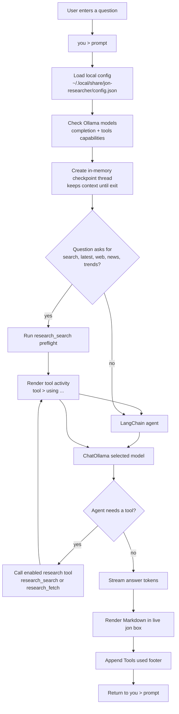

# Researcher Working Diagram

This diagram shows how Jon handles a question from the terminal prompt through model selection, research tools, streaming output, and the in-memory conversation thread.

## Flow Notes

- Jon starts directly at the `you >` prompt and accepts slash commands such as `/help`, `/configure`, `/researcher`, `/status`, and `/exit`.
- First-time setup asks the user to select an installed Ollama model that reports both `completion` and `tools` capabilities.
- Search-like questions trigger a free research preflight before the model writes the answer.
- Tool calls are shown in the terminal as they happen, then summarized at the end of the rendered answer.
- Conversation context is held in memory for the current run only. After exit, the next run starts without previous chat history.
